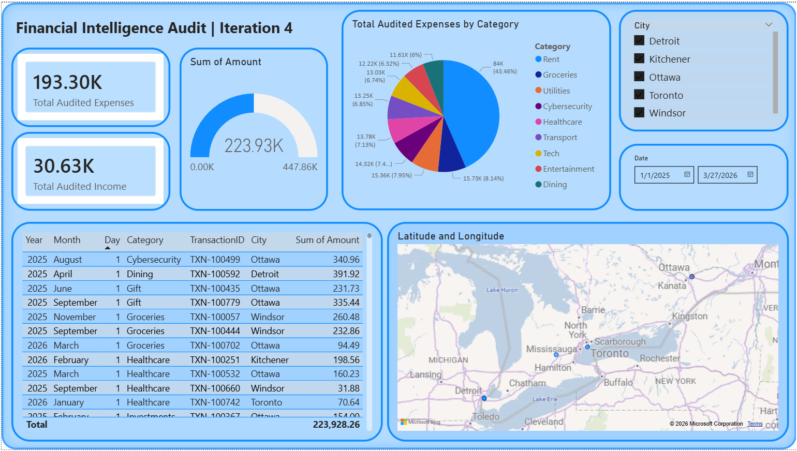
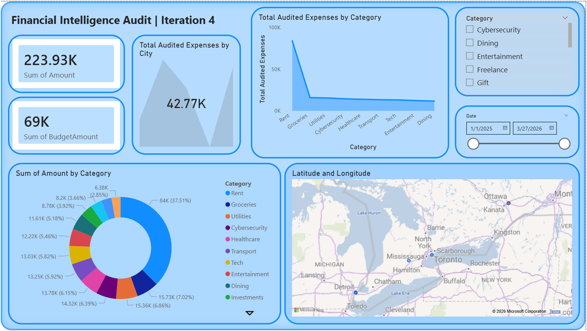

# 🚀 Autonomous Financial Data Engineering & Analytics Pipeline
**SQL Server | Python ETL | Power BI Advanced Analytics**

## 📌 Project Overview
This repository showcases a professional data engineering and business intelligence pipeline. [cite_start]The project automates the generation of complex financial datasets, manages data persistence through a relational **SQL Server** backend, and delivers strategic insights via a high-performance **Power BI** dashboard. [cite: 5]

[cite_start]By moving beyond static files, this architecture simulates a real-world enterprise environment where data flows from a scripted source into a data warehouse for robust reporting. [cite: 5]

---

## 🏗️ Architecture & Data Flow
1. [cite_start]**Extraction & Generation (Python):** A custom Python ETL script generates ~2,500 rows of transactional data with realistic geographic distribution (Windsor, Toronto, Detroit, Kitchener, Ottawa). [cite: 5, 8]
2. [cite_start]**Storage & Persistence (SQL Server):** Using `SQLAlchemy` and `pyodbc`, the script performs a high-speed data load into a local **SQL Server (SSMS)** instance. [cite: 5]
3. [cite_start]**Modeling (Star Schema):** Data is structured into a professional Star Schema within Power BI, utilizing a dedicated `Dim_Date` table for optimized performance. [cite: 5]
4. [cite_start]**Analytics (DAX):** Advanced measures for Budget Variance, Month-over-Month (MoM) growth, and Cumulative "Burn Rate" analysis. [cite: 5]

---

## 📊 Dashboard Preview

[cite_start]*Figure 1: Executive Summary showing YTD Spending and Budget Variance.* [cite: 5]

[cite_start]*Figure 2: Transactional Audit page with Anomaly Detection and Burn Rate analysis.* [cite: 5]

---

## 🛠️ Tech Stack
* [cite_start]**Python 3.x**: Pandas, SQLAlchemy, PyODBC (ETL & Data Engineering) [cite: 5]
* [cite_start]**SQL Server (SSMS)**: Enterprise-grade relational data storage [cite: 5]
* [cite_start]**Power BI**: Advanced DAX modeling and interactive visualization [cite: 5]
* [cite_start]**Data Modeling**: Star Schema (One-to-Many relationships) [cite: 5]

---

## 🚀 Project Evolution

### Iteration 1 & 2: Foundations & Relational Modeling
* [cite_start]Generated synthetic financial data and architected a relational model. [cite: 5]
* [cite_start]Established basic tracking for Income vs. Expenses and Geographic mapping. [cite: 5]

### Iteration 3: SQL Data Engineering (Current Phase) 📍
* [cite_start]Migrated from flat CSV files to a **Live SQL Server** backend. [cite: 5]
* [cite_start]Engineered a Python-to-SQL pipeline using batch inserts (`fast_executemany`) for performance. [cite: 5]
* [cite_start]Implemented live data refresh capability in Power BI. [cite: 5]

### Iteration 4: Data Quality & Cleaning (Current Phase)
* [cite_start]Simulating real-world "messy" data including null values, duplicates, and inconsistent strings. [cite: 5]
* [cite_start]Demonstrating advanced **Power Query** and **SQL** cleaning techniques to ensure data integrity. [cite: 5]

### Iteration 5: Real-World Case Studies (Upcoming)
* [cite_start]Applying the pipeline to solve diverse business problems. [cite: 5]
* [cite_start]Focusing on multi-industry scenarios including Finance, Marketing, and Operations. [cite: 5]

---

## ⚙️ How it Works
[cite_start]The pipeline uses **SQL Server Express** as the central data hub. [cite: 5]
* [cite_start]**Automation**: The Python script handles the creation of `Fact_Transactions_Messy` and `Fact_Budget_Messy` tables. [cite: 5]
* [cite_start]**Direct Pipeline**: Power BI connects via **ODBC**, allowing for an instant dashboard refresh whenever new data is injected by the script. [cite: 5]
* [cite_start]**Geographic Accuracy**: Specifically engineered latitude/longitude coordinates ensure pinpoint accuracy for map visuals across regional borders. [cite: 5, 8]

---

## 📖 How to Run This Project
1. [cite_start]**SQL Setup**: Create a database named `FinancePortfolioDB` in SQL Server Management Studio. [cite: 5]
2. [cite_start]**Driver**: Install `ODBC Driver 17 for SQL Server`. [cite: 5]
3. [cite_start]**Run ETL**: Execute `script/datagenerator.py` to populate the SQL tables with generated messy data. [cite: 5]
4. [cite_start]**Connect PBIX**: Open the `.pbix` file and update the Data Source settings to point to your local SQL Server instance. [cite: 5]

---

## 📂 Repository Structure
* [cite_start]`/script/datagenerator_sqlserver.py`: ETL script for data generation and SQL injection. [cite: 5]
* [cite_start]`/images/`: High-resolution images of the dashboard. [cite: 5]
* [cite_start]`Financial_Intelligence_V4.pbix`: The master Power BI dashboard file. [cite: 5]
